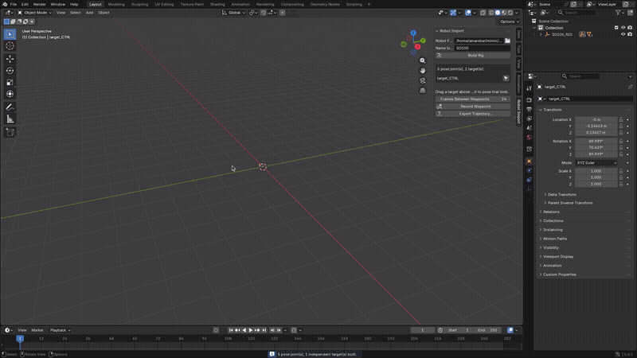
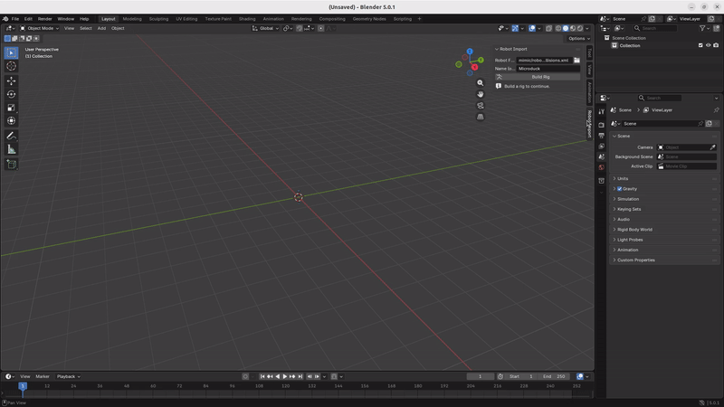
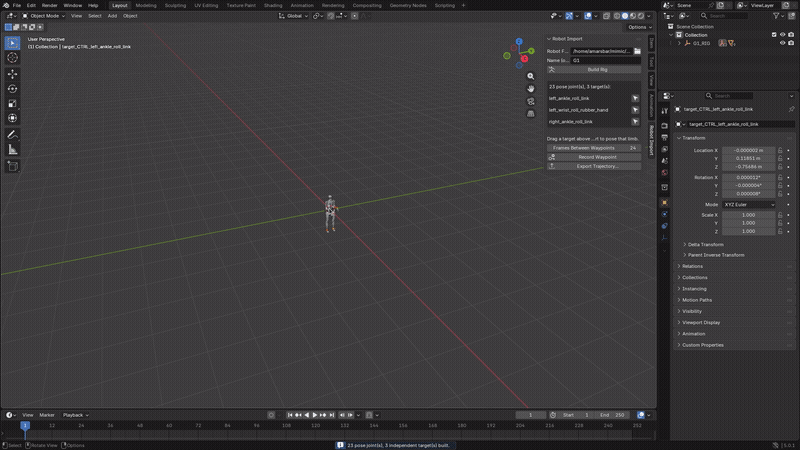
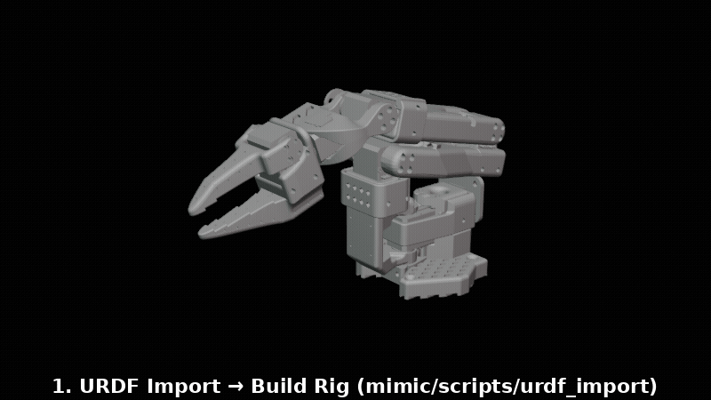
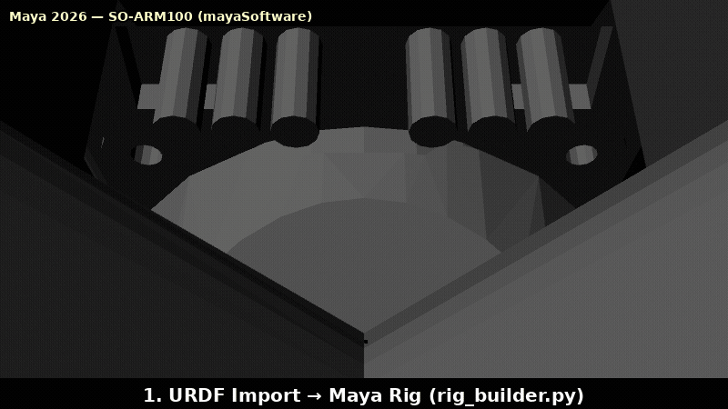
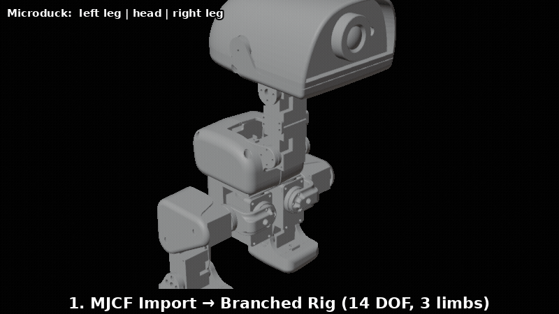

# Generic URDF/MJCF Importer for Mimic — Maya + Blender

Bring in a robot description file (URDF or MJCF — the formats used by
ROS, Gazebo, MuJoCo, and most robotics research/hobby projects), get a
fully assembled, animatable robot in return. Drag a handle in the
viewport and the robot follows, just like posing a character. Works for
a simple desktop arm, a four-legged robot, or a full humanoid — the
importer figures out the joints and limbs from the file automatically.

Validated on **SO-ARM100**, **SO-ARM101**, **Unitree G1** (humanoid), and
**Microduck** (a small biped). Runs in **Blender** (free, no license —
recommended if you're not sure which to use) and in **Maya** (extends
Mimic itself).

---

## Quickstart — no programming required

This is the Blender path: 3 minutes to install, then everything else is
buttons. (Maya users: see [Using it in Maya](#using-it-in-maya) below —
same idea, slightly different install.)

### 1. Install (one time)

1. Get [Blender](https://www.blender.org/download/) (free) if you don't
   have it, and clone or download this repository.
2. In Blender: **Edit → Preferences → Add-ons → Install...**
3. Select
   [`mimic/scripts/urdf_import/mimic_robot_importer_addon.py`](mimic/scripts/urdf_import/mimic_robot_importer_addon.py)
   from wherever you put this repo, and enable the checkbox next to
   **"Import: Mimic Robot Importer"** that appears.
4. Still in that Preferences panel, expand the add-on and set **Repo
   Path** to the folder you put this repo in (the one with a `mimic`
   folder inside it). This is the only setup step — everything from here
   on is clicking, not typing.

### 2. Import a robot and pose it

In the 3D Viewport, press **N** to open the sidebar if it's not already
open, and click the **Robot Import** tab. Browse to a `.urdf` or `.xml`
(MJCF) file — a few are already included under
[`mimic/robot_descriptions/`](mimic/robot_descriptions) if you just want
to try it — and click **Build Rig**.

That's it: the robot appears, fully assembled, with a handle (an orange
arrow icon, `target_CTRL`) at the end of each limb it can solve for.
**Drag any handle and the limb follows it live.**

<p align="center"></p>

Robots with more than one limb — legs, arms, a head — get one
independent handle per limb, listed by name in the panel with a
**Select** button next to each, so you always know which handle moves
which part:

<p align="center"></p>

<p align="center"></p>

> **New — full workflow as rendered GIFs** (headless Blender `BLENDER_WORKBENCH` / Maya `mayaSoftware`, empties are interactive viewport handles so they don't appear in the final render — you drag the orange `target_CTRL` arrow live in the real UI):
>
> <p align="center"></p>
> *Blender (free) — SO-ARM100: `so100.urdf` → **Build Rig** → drag `target_CTRL` (live IK via `robotIKGeneric`/`generic_ik.py`) → **Record Waypoint** per pose → **Export Trajectory** → `trajectory.json` (60 frames, 4 waypoints, smoothstep-interpolated here).*
>
> The identical `trajectory.json` round-trips from Maya (same URDF, same waypoint angles, same `t` normalisation — see [Maya ↔ Blender cross-check](#hardware-output)'s `trajectory_export.py` guarantee):
>
> <p align="center"></p>
> *Maya 2026 — `so100.urdf` → `rig_builder.build_rig()` → FK sliders / `target_CTRL` IK → `trajectory_export.export_from_maya()` → same `trajectory.json` schema (`mimic.trajectory.v1`) consumed by `feetech_playback.py`/`ros_trajectory_export.py`.*
>
> <p align="center"></p>
> *Branched MJCF — `Microduck/robot_allcollisions.xml` (14 hinge DOFs, 3 independent IK chains: `ankle_left`, `ankle_right`, `jaw_soft`) → per-limb `target_CTRL` → branched `blender_rig_builder`/`rig_builder` parity (`_is_branched`, `_select_independent_chains` shared verbatim) → `trajectory_export` 14-DOF `trajectory.json`.*

### 3. Record a performance, export it

Pose the robot, click **Record Waypoint** — that's one frame of
animation captured, and the timeline jumps forward automatically so the
next pose you record becomes the next waypoint. Repeat as many times as
you like, then scrub the timeline (or press Space to play) to preview it
— it plays back exactly like animating a character, because that's
genuinely what's happening under the hood.

When you're happy with it, click **Export Trajectory...** to save a JSON
file with every waypoint you recorded. That file is what you hand to
`mimic/scripts/hardware/feetech_playback.py` (to drive real Feetech
servos, e.g. a physical SO-ARM100) or `ros_trajectory_export.py` (to
drive anything on ROS2) — see
[`mimic/scripts/hardware/README.md`](mimic/scripts/hardware/README.md).

### If something goes wrong

- **"Set Repo Path..." error** — you skipped step 4 above; go back to
  Preferences and fill it in.
- **Build Rig does nothing / an error appears** — check the small status
  line under the button, and Blender's System Console (Window → Toggle
  System Console on Windows; run Blender from a terminal on Linux/macOS)
  for the full message.
- **The robot looks scattered/broken** — the file's mesh references may
  be missing or its geometry may use a joint type this importer doesn't
  yet support (only rotating/hinge joints are supported — sliding joints
  are reported, not silently guessed at). Try one of the bundled robots
  first to confirm the add-on itself is working.

---

## Using it in Maya

Same underlying importer, extending Mimic's own rigging tools instead of
a standalone add-on. Needs a working Maya install (and its license):

```python
import sys
sys.path.insert(0, r"<repo>\mimic\scripts")
sys.path.insert(0, r"<repo>\mimic\scripts\urdf_import")
import maya.cmds as cmds
cmds.loadPlugin(r"<repo>\mimic\plug-ins\robotIKGeneric.py")
import urdf_import_ui; urdf_import_ui.urdf_import_ui()
```
(On Linux/macOS, use `/` and forward-slash paths.) That opens a window
with the same Browse / Build Rig flow described above, plus FK sliders.
Drag `target_CTRL` in the viewport for IK, same as Blender.

---

## Layout

| File | Host | Purpose |
|---|---|---|
| `mimic/scripts/urdf_import/urdf_parser.py` | none (stdlib) | URDF → ordered kinematic chain |
| `mimic/scripts/urdf_import/mjcf_parser.py` | none (stdlib) | MJCF → shared robot/tree model |
| `mimic/scripts/urdf_import/model_parser.py` | none (stdlib) | URDF/MJCF format dispatch |
| `mimic/scripts/robotmath/generic_ik.py` | none (numpy) | N-DOF FK + damped-least-squares IK |
| `mimic/scripts/urdf_import/rig_builder.py` | Maya | builds the Maya rig |
| `mimic/plug-ins/robotIKGeneric.py` | Maya | `robotIKGeneric` DG node (live IK) |
| `mimic/scripts/urdf_import/urdf_import_ui.py` | Maya | import window + FK sliders |
| `mimic/scripts/urdf_import/blender_rig_builder.py` | Blender | builds the Blender rig |
| `mimic/scripts/urdf_import/trajectory_export.py` | Maya + Blender | keyframes → trajectory JSON |
| `mimic/scripts/hardware/feetech_playback.py` | none (plain python3) | trajectory JSON → real Feetech servos |
| `mimic/scripts/hardware/ros_trajectory_export.py` | none (plain python3 + ROS2) | trajectory JSON → ROS2 JointTrajectory |

The parser and solver have **no DCC dependency** and are shared verbatim by
both hosts — only scene-graph construction differs. That is what makes the
Maya↔Blender cross-check meaningful.

Blender's rig builder now shares Maya's branched-robot support (multiple
independent IK chains — one per limb — for humanoids/quadrupeds; see
"Branched robots" below): it reuses Maya's branch-selection logic directly
(`rig_builder._is_branched`, `_select_independent_chains` — pure Python, no
`maya.cmds`), so the two hosts always agree on which limbs get IK.

---

## Branched robots

Maya builds the complete geometry and FK hierarchy for branched descriptions.
Each disjoint root-to-leaf joint chain receives its own numerical IK node and
target control. Microduck therefore gets independent left-foot, head, and
right-foot targets plus FK controls for all 14 hinge joints.

If two end-effectors share an upstream driven joint, Maya cannot connect two
independent solver outputs to that same rotation channel. The deepest chain
gets IK and the overlapping branch remains FK-only, with a build warning.
This preserves the complete animatable robot without pretending independent
IK goals can safely own the same joints.

MJCF root `freejoint` motion maps to Maya's `local_CTRL`. Simulation-only
contacts, inertials, sensors, actuators, and equality constraints are not
needed for animation and are not imported.

---

## Why a new node instead of extending `robotIKS`

`robotIK.py`'s `robotIKS` has a **fixed 6-slot** attribute schema
(`theta1..theta6`, `a1_fk..a6_fk`, …) and `mimic_utils.py` hardcodes a
different rotate channel per axis (`axis1→rotateY, axis2→rotateX, …`) in
~15 places. Both are correct for the ~60 hand-built industrial rigs Mimic
ships, and refactoring them in place would risk all of those.

`robotIKGeneric` instead uses Maya **array attributes** sized by
`numJoints`, and every generated rig rotates uniformly about **local Z** —
each joint is built as a static `axis{i}_frame` (rest origin, local +Z
aligned to the URDF joint axis) plus an animated `axis{i}` child. So the
URDF's arbitrary axis directions need no per-axis channel mapping.

---

## The 5-DOF problem (important for SO-ARM)

**The SO-ARM100/101 have 5 pose DOFs**, not 6 (the 6th joint is the gripper
jaw — an actuator, not a pose DOF). A 5-DOF arm **cannot** generically reach
an arbitrary position *and* orientation.

So when you drag the IK handle to a new position while keeping its
orientation, that combination is usually impossible, and the solver must
choose. `rot_weight` controls the choice. Measured medians on both arms:

| `rot_weight` | position error | orientation error | |
|---|---|---|---|
| 1.0 | **18.0 mm** | 0.3° | tip visibly off the handle |
| 0.2 | 8.7 mm | 2.3° | |
| **0.05** (default for <6 DOF) | **1.4 mm** | 5.5° | chosen compromise |
| 0.0 | 0.03 mm | **18.7°** | gripper orientation adrift |

Defaults come from `generic_ik.recommended_rot_weight()`: `1.0` for ≥6 DOF,
`0.05` below that. Override per-rig via the node's `rotWeight` attribute
(negative = auto).

`converged=False` on a 5-DOF arm is **expected**, not a failure — it means
the full 6-DOF pose wasn't reachable. Check `ikPositionError` instead.

---

## Verification

Everything is checked against **pybullet**, an independent URDF parser and
FK implementation.

| Check | Result |
|---|---|
| Our FK vs pybullet, 200 random poses × 2 robots | max **2.7e-08 m** (0.000027 mm) |
| Maya rig joint positions vs pybullet | max **1.2e-08 m** (SO-100), 1.2e-06 m (SO-101) |
| Blender rig joint positions vs pybullet | max **3.5e-08 m** (SO-100), 1.2e-06 m (SO-101) |
| IK round-trip, reachable targets | 25/25 within **0.1 mm** |
| Interactive-drag convergence (single-shot) | 49/50 and 50/50 |
| FK passthrough (Maya, IK off) | exact |
| Visual render | correct assembled arms, both hosts |

### Known precision floors (not bugs)

* **Blender: ~1e-6 m.** Blender stores object transforms as **float32**
  (verified: a float64 location reads back as exactly its float32 value).
  Over a 5-joint chain at ~0.25 m this accumulates ~1 µm.
* **Maya SO-101: 1.18 µm.** Maya stores rotation as **Euler angles**, and
  the SO-101's joint-2 frame sits at gimbal lock (−90.0002°, −89.9998°), so
  its matrix cannot round-trip exactly. Affects only the *drawn* mesh — the
  solver receives exact matrices via the `jointOriginMatrix` matrix
  attribute, bypassing Euler decomposition entirely.

Both are ~170× smaller than the ≈0.2 mm tolerance of a 3D-printed part.

---

## Python API (scripting, not the click-driven add-on)

For automation, testing, or just preferring code over buttons. The
[Quickstart](#quickstart--no-programming-required) above covers the
add-on UI; this is the same underlying functions, called directly. All
paths below are relative to a checkout of this repo (`<repo>` = wherever
you cloned it — on Windows that's just the checkout folder, same idea,
Windows paths).

```python
# Blender
import sys
sys.path += [r"<repo>\mimic\scripts", r"<repo>\mimic\scripts\urdf_import"]
import blender_rig_builder as brb
rig = brb.build_rig(r"<repo>\path\to\robot.urdf")
brb.install_live_ik(rig)               # drag any target_CTRL in the viewport, it re-solves live
brb.record_waypoint(rig)                # keyframe the current pose
```
```python
# Maya
import sys
sys.path.insert(0, r"<repo>\mimic\scripts")
sys.path.insert(0, r"<repo>\mimic\scripts\urdf_import")
import maya.cmds as cmds
cmds.loadPlugin(r"<repo>\mimic\plug-ins\robotIKGeneric.py")
import urdf_import_ui; urdf_import_ui.urdf_import_ui()
```
(On Linux/macOS, use `/` and forward-slash paths instead of the `r"..."` Windows form.)

Bundled validation descriptions (including their mesh assets) are available at:

```text
<repo>/mimic/robot_descriptions/SO100/so100.urdf
<repo>/mimic/robot_descriptions/SO101/so101_new_calib.urdf
<repo>/mimic/robot_descriptions/UnitreeG1/g1_23dof.urdf
<repo>/mimic/robot_descriptions/Microduck/robot_allcollisions.xml
```

## Tests

Run these from the repo root.

```bash
python3 test/test_generic_ik.py
python3 test/test_mjcf_import.py
python3 test/test_hardware_export.py
```
```bash
mayapy test/build_and_check.py mimic/robot_descriptions/SO100/so100.urdf
mayapy test/build_and_check.py mimic/robot_descriptions/SO101/so101_new_calib.urdf
mayapy test/build_mjcf_and_check.py
```
(`mayapy` ships inside the Maya install, e.g.
`C:\Program Files\Autodesk\Maya2026\bin\mayapy.exe` on Windows.)
```bash
blender --background --python test/blender_check.py -- <urdf> out.json out.png
```

To try the actual add-on UI interactively (what the Quickstart demos
above show), rather than the headless checks: `blender --python
test/blender_addon_demo_setup.py -- <urdf> [robot_name]` installs and
enables the add-on, points it at this repo, and pre-fills the robot
path — everything after that is real clicks in a real Blender window
(Build Rig, drag a target, Record Waypoint, Export Trajectory...).

---

## Hardware output

Two independent paths from a keyframed animation to real hardware — both
consuming the same DCC-agnostic trajectory JSON, so recording once gets you
both. Full details, including the real bugs this surfaced and fixed (a
gripper `range_0_100` conversion that would otherwise have commanded the
wrong physical position) in [`mimic/scripts/hardware/README.md`](mimic/scripts/hardware/README.md).

```
keyframe target_CTRL/axis objects (Maya or Blender's own animation tools)
              |
              v  trajectory_export.py
      trajectory.json  (DCC-agnostic: joint_names, fps, waypoints)
              |
      -----------------------------------------
      |                                       |
      v                                       v
feetech_playback.py                 ros_trajectory_export.py
(any Feetech-servo robot,           (JointTrajectory: publish to a
 built on lerobot's motor bus)       topic, write a rosbag2, or send a
                                      FollowJointTrajectory goal)
```

```bash
# Record: drag target_CTRL, press I (Blender) or S (Maya) to keyframe it,
# repeat for each waypoint, then export from that DCC's python console:
#   te.export_from_blender(rig, "traj.json")   /   te.export_from_maya(rig, "traj.json")

# See it without touching hardware:
python3 mimic/scripts/hardware/feetech_playback.py --trajectory traj.json \
    --servo-map mimic/scripts/hardware/servo_maps/so_arm_feetech.json --dry-run

# Real SO-ARM100/101 (or any Feetech-servo robot, with its own servo_map):
python3 mimic/scripts/hardware/feetech_playback.py --trajectory traj.json \
    --servo-map mimic/scripts/hardware/servo_maps/so_arm_feetech.json --port /dev/ttyUSB0

# ROS2 (any ros2_control robot):
source /opt/ros/humble/setup.bash
python3 mimic/scripts/hardware/ros_trajectory_export.py --trajectory traj.json \
    --servo-map mimic/scripts/hardware/servo_maps/so_arm_feetech.json \
    --action-server /arm_controller/follow_joint_trajectory
```

Tested end-to-end here (see `test/test_hardware_export.py`): real keyframes
→ export → content-checked JSON → Feetech `--dry-run` (including the
gripper degree→percent math) → ROS2 bag written and read back byte-exact,
plus a live publish confirmed delivered to a real subscriber. What isn't
testable without physical hardware: a real servo bus on `--port`, and a
real `FollowJointTrajectory` action server accepting the goal — both use
well-established libraries doing exactly what their reference
implementations do, but "the bytes on the wire are right" and "the robot
moves correctly" are different claims.

## Scope

Working: URDF/MJCF parse, mesh import, auto-rig, N-DOF IK/FK animation,
gripper as FK tool control, complete branched FK trees with independent
per-limb IK in both Maya and Blender, one-click waypoint recording and
trajectory export via a real installable Blender add-on (no scripting
required), and hardware output (Feetech serial and ROS2) from a recorded
trajectory.

Not included: Mimic's existing keyframe-baking and program-export tools
(those remain hardcoded to 6 axes — the new hardware-output path above is
a separate, parallel export, not an extension of Mimic's own
postprocessors); prismatic/planar joints (reported and skipped). MJCF root
freejoints map to `local_CTRL`; non-root freejoints are rejected.
